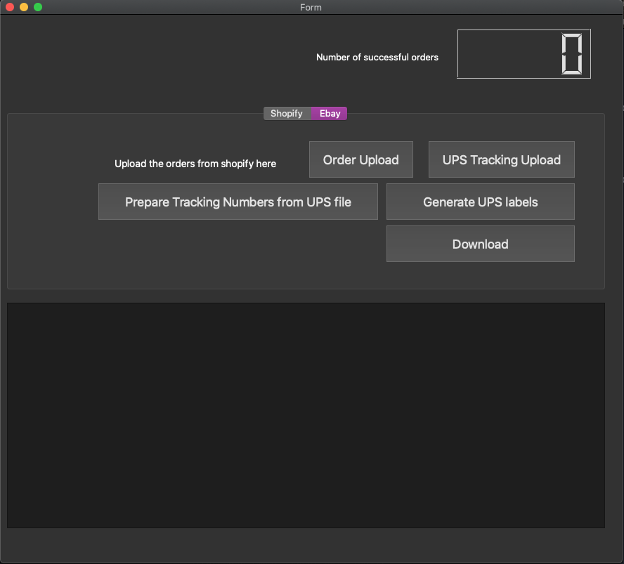

# Shopify and eBay to UPS and ParcelForce CSV generator

This python applications generates a csv file with "Mark as dispatched template" of Ebay 2020

## GUI (work in progress)

The GUI is designed and developed with Python QT library.



## Step By step instructions

You have to first create a virtual environment:

```
python3 -m venv venv
```

You have to enable virtual environment after that:

```
source venv/bin/activate
```

now, you need install the libraries with PIP:

```
pip install -r requirements.txt
```

now you are ready! you now can go to ebay or shopify folder and you can execute the code by just typing:

```
python csv_generator.py
```

to test the GUI, use the below command:

```
python main.py
```
